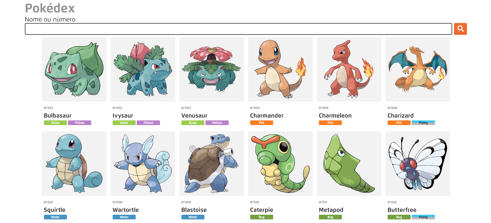

# Pokedex-react

> Projeto de uma Pokédex consumindo a PokeAPI usando React

## 🚀 Acesse o projeto em:
[Site](https://pokedex-react-sigma.vercel.app/)
## 🚧 Projeto em construção
- [x] Listar pokémons
- [x] Pesquisar pokémons
- [ ] Visualizar mais informações sobre o pokémon selecionado ou pesquisado (Em produção)
    - [ ] Clonar interface do site oficial do pokémon (Em produção)
    - [x] Mudar a descrição do pokémon selecionando a versão do jogo
    - [ ] Mudar a arte do pokémon
    - [ ] Adicionar mais informações disponíveis
- [x] Visão mobile
- [ ] Tema dark
- [ ] Botão para ativar scroll infinito na listagem de pokémon
- [ ] Organizar resultados por...
- [ ] Card com breve informações quando der hover em um pokémon listado
- [ ] Refatorar

[⬆ Voltar ao topo](#Pokedex-react) 